# Agent Operating System

**Last updated:** 2026-08-30
**What this is:** The constitution and catalog for the WordKrush Grok-bot fleet — how judgment work is delegated to specialist Cursor Cloud Agents plus project skills, what each bot does, what it writes, and where it stops.

This is the operating contract. When a bot's behavior changes, this document changes in the same PR.

---

## Architecture

The WordKrush operating system splits judgment work (deciding what to build, what to write, when to act) from deterministic execution (CI, deploy, scheduled sends, content merge). Grok bots judge; GitHub Actions execute.

```mermaid
graph TB
    subgraph "Judgment Layer — Cursor Cloud Agents + Skills"
        CONDUCTOR[wordkrush-conductor<br/>Daily ops read]
        CLUELESS[clueless-daily<br/>18:00 GMT+1]
        WORDFALL[wordfall-weekly<br/>Weekly buffer]
        XGROWTH[x-growth<br/>3×/day organic]
        EMAIL[player-email<br/>Monday after Wordfall]
        HEALTH[product-health<br/>Weekly]
        EXPERIMENT[experimentation<br/>Weekly after health]
        FEATUREDEV[feature-dev<br/>On Superthread card]
        QA[qa-playtest<br/>After web CI on PR]
        REVIEW[code-review<br/>PR opened]
        WIKIPEDIA[wikipedia-reviewer<br/>Monday after Action]
        FEEDBACK[posthog-surveys-triage<br/>Daily]
        SECURITY[security-watch<br/>On alert / weekly]
        GROWTHSEO[growth-seo<br/>After Phase 0]
        ADCREATIVE[ad-creative<br/>On demand]
    end
    
    subgraph "Execution Layer — GitHub Actions"
        CICHECK[ci.yml<br/>check + web]
        MERGE[merge-labeled-content.yml<br/>Auto-merge content PRs]
        WIKI[wikipedia-popularity-weekly.yml<br/>Monday 09:00 UTC]
        PLAYEREMAIL[player-email-weekly.yml<br/>Tuesday 09:00 UTC]
        RELEASE[release.yml<br/>vX.Y.Z from CHANGELOG]
    end
    
    subgraph "Write Surfaces"
        PR[Pull Requests]
        SUPERTHREAD[Superthread Cards]
        XCOM[X @WordKrushGame]
        LEDGER[~/.wordkrush-social/ledger.json]
        OBSERVABILITY[docs/OBSERVABILITY.md]
    end
    
    CONDUCTOR -->|Reports only| SUPERTHREAD
    CLUELESS -->|content/clueless-daily| PR
    WORDFALL -->|content/wordfall-weekly| PR
    XGROWTH -->|Browser posts| XCOM
    XGROWTH -->|Ledger| LEDGER
    EMAIL -->|Draft into pipeline| PR
    HEALTH -->|Weekly report| SUPERTHREAD
    HEALTH -->|Metrics notes| OBSERVABILITY
    EXPERIMENT -->|Proposal cards| SUPERTHREAD
    FEATUREDEV -->|Feature branch| PR
    QA -->|Test report| PR
    REVIEW -->|Review comments| PR
    WIKIPEDIA -->|Review comments| PR
    FEEDBACK -->|Triage cards| SUPERTHREAD
    SECURITY -->|Incident notes| SUPERTHREAD
    GROWTHSEO -->|Landing PRs| PR
    ADCREATIVE -->|marketing/video/| PR
    
    PR --> CICHECK
    CICHECK --> MERGE
    MERGE --> RELEASE
    WIKI --> PR
    PLAYEREMAIL -.-> Email[Resend Broadcast]
    
    style CONDUCTOR fill:#4A5568
    style CLUELESS fill:#22C55E
    style WORDFALL fill:#22C55E
    style XGROWTH fill:#1E90FF
    style FEEDBACK fill:#22C55E
    
    classDef built fill:#22C55E,stroke:#16A34A,color:#000
    classDef planned fill:#64748B,stroke:#475569,color:#FFF
    classDef action fill:#3B82F6,stroke:#2563EB,color:#FFF
    
    class CLUELESS,WORDFALL,FEEDBACK,CICHECK,MERGE,WIKI,PLAYEREMAIL,RELEASE built
    class CONDUCTOR,XGROWTH,EMAIL,HEALTH,EXPERIMENT,FEATUREDEV,QA,REVIEW,WIKIPEDIA,SECURITY,GROWTHSEO,ADCREATIVE planned
```

**The split:**
- **Bots judge.** They read the board, the repo, the logs, the metrics, and the X account. They draft content, propose experiments, review PRs, author Superthread cards, and write reports. They never become `npm run check`, never replace CI, and never push to `master`.
- **Actions execute.** CI runs `check` and `build:web` on every push. Content PRs merge only after exact-head CI passes. The Tuesday job sends the Resend Broadcast. Wikipedia rotate opens a review PR. Release.yml publishes GitHub Release `vX.Y.Z` from the changelog.

---

## Shared operating rules

Every bot in the fleet follows these constraints:

### Constitutional limits

1. **Bots never push to `master`.** Feature and fix PRs use Superthread `suggested_branch_name`. Standing content branches (`content/clueless-daily`, `content/wordfall-weekly`, Wikipedia rotate) open PRs that merge through the Action only after CI.
2. **Bots do not bypass CI.** The content auto-merge Action is the only path that closes a PR without human approval, and it waits for exact-head `check` + `web` green.
3. **Bots stop at owner-only work.** Apple Developer, Expo login, EAS submit, Supabase migrations, money, captchas, `.env` secrets, force-merge, administrative CI override, [OPEN]/[DECIDE] cards, PostHog remote flags (D-024), and Wikipedia PR merge are human gates. A bot writes a Superthread card and stops.
4. **Acquisition in this OS is organic X only** (@WordKrushGame). No Reddit posts, no Devvit launch, no DMs, no paid. The `reddit/` app and `.cursor/skills/reddit-ad-posts/` stay in the repo, unscheduled.
5. **Remote flags stay off** (D-024). The experimentation bot proposes [DECIDE] cards; the owner ships flags only after that decision flips.
6. **No new dependencies, backends, or analytics properties** without explicit owner approval and matching STACK / HOW-IT-WORKS update.
7. **Real prose, no placeholders.** `npm run check:docs` will fail empty headings or TODO stubs.

### Stop conditions

A bot stops and writes a Superthread card when:
- The task needs owner-only access (accounts, secrets, money, admin override)
- A material decision is [OPEN] or [DECIDE] (behavior, architecture, cost, security, data, deployment)
- The development environment is broken and three remediation attempts have failed
- A test or verification step fails and the root cause is outside the bot's write surface (e.g., a failing Wikipedia CI check when the bot is authoring Clueless content)

### Branch and merge rules

- **Feature/fix PRs** use the Superthread card's `suggested_branch_name`. Do not invent a parallel branch.
- **Standing content branches** (`content/clueless-daily`, `content/wordfall-weekly`) are documented exceptions (D-057, D-058, D-059, D-060). Applying `automation:auto-merge` marks an eligible draft ready; the Action merges only after exact-head CI passes.
- **Wikipedia rotate** uses `content/wikipedia-popularity-weekly`. Human-reviewed; never auto-merge.
- **Stacked PRs** are allowed; the child PR targets the parent branch and states the dependency.

### Testing and verification

- **Content loops** (Clueless, Wordfall) run `npm run check`, `npm run build:web`, local `npm run serve:web`, and a manual playtest before `git push`.
- **Feature/fix PRs** run `npm run check` locally. CI runs both `check` and `web`; merge waits for both.
- **Manual testing** is required for non-trivial UI changes. Use the `computerUse` subagent for GUI-driven testing; terminal commands for shell-based verification. Record walkthrough artifacts under `/opt/cursor/artifacts/`.

---

## The fleet

| Bot ID | Skill Path | Trigger | Writes | Merge | Status |
|--------|-----------|---------|--------|-------|--------|
| **clueless-daily** | `.cursor/skills/clueless-daily-path/` | 18:00 GMT+1 daily | `content/clueless-daily` PR | CI + `automation:auto-merge` | **[BUILT]** skill + merge; schedule [PLANNED] |
| **wordfall-weekly** | `.cursor/skills/wordfall-weekly-gauntlet/` | Weekly (e.g. Wed) | `content/wordfall-weekly` PR | CI + `automation:auto-merge` after local `serve:web` playtest | **[BUILT]** skill + merge; schedule [PLANNED] |
| **wikipedia-reviewer** | *Cursor ad-hoc, no committed skill* | Monday after `wikipedia-popularity-weekly.yml` | PR comments only | Owner merges after review | **[PLANNED]** automation |
| **x-growth** | Ship-led playbook to be written, then implement | On shipped drop/vault, real player share, or inbound reply | `~/.wordkrush-social/ledger.json` + X via browser | n/a (social posts, not code) | **[PLANNED]** — prior autonomous 3×/day reply-bot playbook REJECTED; replacement is ship-led skill |
| **player-email** | *Cursor ad-hoc, pipeline draft* | Monday after Wordfall merge | Draft into `pipeline/` or PR | Action `player-email-weekly.yml` sends Tuesday 09:00 UTC | **[PLANNED]** draft automation; Action [BUILT] |
| **product-health** | *Cursor ad-hoc* | Weekly | Superthread health cards + `OBSERVABILITY.md` notes | No code merge; owner acts on cards | **[PLANNED]** |
| **experimentation** | *Cursor ad-hoc* | Weekly after health | Superthread [DECIDE] cards proposing tests from PostHog | Owner decides; no flag ships until D-024 flips | **[PLANNED]** |
| **feature-dev** | *Cursor ad-hoc, Superthread card context* | On card moved to Doing | Superthread `suggested_branch_name` + feature PR | Owner merges after review | **[PLANNED]** |
| **qa-playtest** | *Cursor ad-hoc* | After `web` CI passes on a feature PR | PR comment + bug Superthread cards | n/a (reports only) | **[PLANNED]** |
| **code-review** | *Cursor ad-hoc* | PR opened (non-content) | PR review comments vs AGENTS.md / STACK / tests | n/a (review only) | **[PLANNED]** |
| **posthog-surveys-triage** | *Cursor ad-hoc* | Daily | Superthread triage cards clustering feedback | n/a (triage only) | **[BUILT]** — PostHog Surveys replaced Userback (0.8.21); triage schedule [PLANNED] |
| **security-watch** | *Cursor ad-hoc* | On alert / weekly audit | Containment notes; no silent schema change | Owner approves; follows `INCIDENT-RESPONSE.md` | **[PLANNED]** |
| **growth-seo** | *Cursor ad-hoc* | After Phase 0 closes (crawlable landing + OG live) | Superthread gap cards + landing PRs | Owner merges | **[PLANNED]** — product gap, not a campaign |
| **ad-creative** | *Cursor ad-hoc* | On demand | `marketing/video/` PR (Remotion / Wordfall clips) | Owner merges | **[PLANNED]** — organic X posts only, not paid |
| **wordkrush-conductor** | *Cursor ad-hoc* | Daily 08:00–12:00 window [PLANNED] | Superthread ops cards + 8–12 line daily report | n/a (read-only ops) | **[PLANNED]** — does NOT write `src/`; does NOT dispatch Reddit |

---

## Bot catalog

### 1. clueless-daily

**Job:** Append one future Daily Vault level to maintain the buffer.

**Trigger:** 18:00 GMT+1 daily Cursor Automation (editor setup [PLANNED]).

**Skill:** `.cursor/skills/clueless-daily-path/SKILL.md` **[BUILT]**.

**Context:** Daily Vaults unlock at local midnight after the player solves their current level (D-057). The bundled catalog in `src/data/clueless/levels.ts` is the schedule; no content is fetched at play time (D-004). The cache-backed validator ensures semantic uniqueness without a runtime model call.

**Writes:**
- Standing `content/clueless-daily` review PR (automation exception to D-021 Superthread branch rule; D-057, D-059, D-060)
- One new `levels.ts` row with reviewed copy, theme, answer, and assistance policy
- Changelog patch bump + new dated section
- `package.json` / `app.json` version bump

**Testing:** `npm run check` must pass locally.

**Merge:** Apply `automation:auto-merge` label. The GitHub Action (`merge-labeled-content.yml`) marks the draft ready, then merges only this named content branch after exact-head CI succeeds. Never pushes to `master`; never bypasses failed or pending checks.

**Stop conditions:**
- Validator rejects every candidate (semantic collision or quality floor)
- Development environment broken after 3 fix attempts
- Supabase unavailable and needed for validation cache

**Owner vs auto-merge:** Auto-merge after CI. Owner intervenes only if the Action reports a failure or if a human review surfaces a content issue.

---

### 2. wordfall-weekly

**Job:** Maintain four future Monday Wordfall levels in the buffer; each drop must have a unique `taskFingerprint` and pass local production-export playtest.

**Trigger:** Weekly (e.g., Wednesday) Cursor Automation (editor setup [PLANNED]).

**Skill:** `.cursor/skills/wordfall-weekly-gauntlet/SKILL.md` **[BUILT]**.

**Context:** Monday drops are bundled `availableFrom` rows in `src/data/wordfall/levels.ts` (D-027, D-038, D-058). The catalog file is the schedule. Featured TTL is seven days (`isNewestRelease`); rows stay after Sunday so numbering has no holes.

**Writes:**
- Standing `content/wordfall-weekly` review PR (D-058, D-059, D-060)
- Appends 1–4 levels to restore the four-week buffer
- Each level: unique task (puzzle vs race + objective kinds), score targets, working title, description
- Changelog patch bump + new dated section
- `package.json` / `app.json` version bump

**Testing:** Before `git push`:
1. `npm run check`
2. `npm run build:web`
3. `npm run serve:web` (port 8080)
4. Manual picker playtest of that static export

**Merge:** Apply `automation:auto-merge`. Action marks draft ready, then merges after exact-head CI. Never pushes to `master`.

**Stop conditions:**
- Catalog generation fails (no valid unique task found after N attempts)
- Local `serve:web` playtest shows the level is unwinnable or the picker is broken
- Environment setup broken after 3 fix attempts

**Owner vs auto-merge:** Auto-merge after CI + playtest. Owner reviews only if the Action or skill reports a failure.

---

### 3. wikipedia-reviewer

**Job:** Review the Monday Wikipedia popularity rotate PR for >10× swings, missing images, and content quality.

**Trigger:** Monday after `wikipedia-popularity-weekly.yml` opens its PR (human trigger or Monday schedule; automation [PLANNED]).

**Skill:** *Cursor ad-hoc; no committed skill yet.*

**Context:** The Monday Action (`wikipedia-popularity-weekly.yml`) re-measures Wikipedia pageviews, enqueues a new unused label round from the reservoir, and opens a PR on `content/wikipedia-popularity-weekly` (D-036, D-052). The bot reads the JSON diff, checks for anomalies, and posts review comments.

**Writes:**
- PR review comments on `content/wikipedia-popularity-weekly` only
- Does NOT commit code; does NOT apply `automation:auto-merge` (Wikipedia is human-reviewed)

**Merge:** Owner reads review comments and merges manually.

**Stop conditions:**
- PR is not from the expected branch or Action
- JSON diff is too large to review (>1000 changed items)

**Owner vs auto-merge:** Human merge always. Bot reviews; owner decides.

---

### 4. x-growth

**Job:** Organic @WordKrushGame X presence. Ship-led: account is the game; originals are drops/vaults/self-played share cards; quotes are real player shares or a playable More or Less hook; replies inbound only. No NYT reply-guy. First spend is a ship moment or a real player share, else hold.

**Trigger:** On shipped drop/vault, real player share detected, or inbound reply (Cursor Automation editor setup [PLANNED]).

**Skill:** Ship-led playbook to be written, then implement as `.cursor/skills/x-growth/`. **Status: REJECTED** — the prior autonomous 3×/day reply-bot playbook was rejected by owner. Replacement is ship-led skill: post on ship moments or real player shares, not autonomous daily loops.

**Context:** Acquisition in this OS is organic X only (constitutional rule #4). No Reddit posts, no Devvit launch, no DMs, no paid (G-004). The bot reads `docs/marketing/CHANNELS.md`, `METRICS.md`, `CHANGELOG.md` (shipped versions), and the ledger (previously posted content). Caps and abort conditions still bind.

**Writes:**
- X posts via browser (needs logged-in session and browser-use)
- `~/.wordkrush-social/ledger.json` (append-only log of posted content to avoid repeats)
- Does NOT write `src/` or documentation
- Does NOT open PRs

**Tools:** Browser automation (logged-in X session) + ledger file I/O.

**Merge:** n/a — social posts, not code.

**Stop conditions:**
- X session expired or unavailable
- Ledger file corrupted or inaccessible
- No ship moment and no real player share (hold rather than post filler)
- Caps exhausted
- Owner-only decision needed (e.g., responding to a brand crisis or legal question)

**Owner vs auto-merge:** Bot posts on ship-led triggers (drops, vaults, real player shares, inbound replies). Owner intervenes for crisis, legal, or off-brand content.

---

### 5. player-email

**Job:** Draft Tuesday player Broadcast subject and body from this week's changelog + Wordfall drop. Quiet weeks (no player-facing changelog, no Wordfall) skip.

**Trigger:** Monday after Wordfall merge (Cursor Automation editor setup [PLANNED]).

**Skill:** *Cursor ad-hoc; drafts into `pipeline/player-email.ts` or a PR.*

**Context:** Tuesday 09:00 UTC Action (`player-email-weekly.yml`) sends the Resend Broadcast using GitHub Environment `best-games` secrets (D-053, D-054, D-062). The Action reads player-facing `CHANGELOG.md` bullets (last 7 days) and `isNewestRelease` Wordfall, drafts copy via OpenRouter, personalizes with Resend merge tags, and creates the Broadcast. The bot's job is to prepare that draft or ensure the facts are ready.

**Writes:**
- Draft email copy into a pipeline script or a review PR
- OR: validates that `CHANGELOG.md` + Wordfall state are ready for the Tuesday Action
- Does NOT send email (Action does that)
- Does NOT write `src/`

**Merge:** If a PR, owner merges. If inline draft, the Tuesday Action uses it directly.

**Stop conditions:**
- No player-facing changelog bullets in the last 7 days AND no Wordfall drop this week → skip (quiet week)
- OpenRouter call fails and fallback draft is missing required facts
- GitHub Environment `best-games` secrets unavailable (Action failure, not bot failure)

**Owner vs auto-merge:** Bot drafts; Action sends; owner reviews only if the Action or Resend reports a failure.

---

### 6. product-health

**Job:** Weekly D0/D7 retention, game mix, share rate, auth funnel, live race activity. Write Superthread health cards + `OBSERVABILITY.md` notes. No code changes.

**Trigger:** Weekly Cursor Automation (editor setup [PLANNED]).

**Skill:** *Cursor ad-hoc.*

**Context:** PostHog dashboard definitions in `docs/OBSERVABILITY.md` (D-022, D-024, D-040). The bot reads event aggregates (not raw events or PII), computes retention cohorts, and reports trends. It does NOT write `src/`, does NOT propose experiments (that's bot #7), and does NOT create PRs.

**Writes:**
- Superthread cards summarizing health (e.g., "D7 retention fell 5pp this week; Clueless level 8 has 60% drop-off")
- `docs/OBSERVABILITY.md` notes section (append-only log of weekly observations)
- Does NOT write `src/` or open feature PRs

**Merge:** n/a — reports and cards only. Owner acts on cards.

**Stop conditions:**
- PostHog unavailable or credentials expired
- Dashboard definitions in `OBSERVABILITY.md` are stale or missing
- Owner-only decision needed (e.g., a metric suggests a data leak or account abuse)

**Owner vs auto-merge:** Bot reports; owner decides what to build next.

---

### 7. experimentation

**Job:** Propose A/B tests from PostHog event data. Write Superthread [DECIDE] cards. Do NOT ship flags until D-024 flips.

**Trigger:** Weekly after product-health (Cursor Automation editor setup [PLANNED]).

**Skill:** *Cursor ad-hoc.*

**Context:** Remote flags are off (D-024 constitutional rule #5). The bot reads PostHog, identifies testable hypotheses (e.g., "More or Less fairness band affects D7 retention"), and writes [DECIDE] cards. It does NOT create flags, does NOT write `src/`, and does NOT open PRs. Owner reviews proposals and decides when to ship a test.

**Writes:**
- Superthread [DECIDE] cards proposing experiments
- Card includes hypothesis, metric, variants, sample-size estimate, and rollout plan
- Does NOT write `src/`, does NOT create PostHog flags

**Merge:** n/a — proposals only. Owner decides.

**Stop conditions:**
- PostHog unavailable
- No experiments to propose (healthy metrics or insufficient data)
- Owner-only decision needed (e.g., experiment affects money, privacy, or legal compliance)

**Owner vs auto-merge:** Bot proposes; owner decides and ships (or rejects).

---

### 8. feature-dev

**Job:** Implement a Superthread card in Doing. Use the card's `suggested_branch_name`, write tests, update docs, run `npm run check`, and open a PR.

**Trigger:** On Superthread card moved to Doing (Cursor Automation editor setup [PLANNED]).

**Skill:** *Cursor ad-hoc; reads Superthread card context.*

**Context:** Feature and fix PRs use the card's git branch name (D-021). The bot reads the card's Description, Context, Scope, Acceptance criteria, and Verification, implements the change, writes or updates tests, updates docs (CHANGELOG, STACK, HOW-IT-WORKS, BRAINSTORM as applicable), runs `npm run check`, and opens a PR.

**Writes:**
- Superthread `suggested_branch_name` feature branch
- `src/` code changes + tests
- Docs updates (`CHANGELOG.md` new version section, `package.json` / `app.json` bump, STACK / HOW-IT-WORKS / BRAINSTORM as needed)
- PR description referencing the Superthread card ID

**Testing:** `npm run check` must pass. Non-trivial UI changes require manual testing via `computerUse` subagent. Record walkthrough artifacts.

**Merge:** Owner reviews and merges manually.

**Stop conditions:**
- Card is [OPEN] or [DECIDE] (bot cannot proceed without owner decision)
- Card is blocked on another card or external dependency
- Implementation requires owner-only access (Apple Developer, EAS, Supabase migration, secrets)
- Tests fail and root cause is environmental or outside the feature scope

**Owner vs auto-merge:** Bot implements; owner merges.

---

### 9. qa-playtest

**Job:** Manual testing of web build after `web` CI passes on a feature PR. Test hub → each game → share → auth empty/error states. Write PR comment + bug cards.

**Trigger:** After `web` job passes on a feature PR (Cursor Automation editor setup [PLANNED]).

**Skill:** *Cursor ad-hoc.*

**Context:** The `web` CI job runs `npm run build:web` and produces a static export. The bot uses the `computerUse` subagent to navigate the deployed preview (or local `serve:web`), tests each game, attempts to share a result, and checks auth flows. It reports findings as a PR comment and creates Superthread bug cards for failures.

**Writes:**
- PR comment with test results (pass/fail per game, screenshots of failures)
- Superthread bug cards for new issues (tagged with PR and severity)
- Does NOT commit code fixes (reports only)

**Merge:** n/a — reports only. Owner or feature-dev bot fixes bugs.

**Stop conditions:**
- `web` CI job failed (nothing to test)
- Deployed preview unavailable and local `serve:web` setup fails after 3 attempts
- `computerUse` subagent unavailable (VM issue)

**Owner vs auto-merge:** Bot tests; owner or another bot fixes.

---

### 10. code-review

**Job:** PR review against AGENTS.md, STACK, WORKFLOW, tests, and type safety. Write review comments. Do NOT approve or merge.

**Trigger:** PR opened (non-content branches; Cursor Automation editor setup [PLANNED]).

**Skill:** *Cursor ad-hoc.*

**Context:** Every feature/fix PR should pass `npm run check` and follow the precision operating standard in `agents.md`. The bot reviews the diff, checks that tests cover behavior changes, that docs are updated, and that the PR follows the task contract. It writes review comments but does NOT approve or merge.

**Writes:**
- PR review comments citing specific lines or missing requirements
- Does NOT commit code, does NOT approve, does NOT merge

**Merge:** Owner reviews bot comments and merges manually (or asks feature-dev bot to address).

**Stop conditions:**
- PR is a content branch (Clueless, Wordfall, Wikipedia) → skip review (those follow a different contract)
- PR is from an external contributor → owner reviews manually

**Owner vs auto-merge:** Bot reviews; owner decides and merges.

---

### 11. posthog-surveys-triage

**Job:** Cluster PostHog Surveys feedback into Superthread triage cards. Daily.

**Trigger:** Daily Cursor Automation (editor setup [PLANNED]).

**Skill:** *Cursor ad-hoc.*

**Context:** PostHog Surveys replaced Userback in v0.8.21 (PR #47). The feedback prompt (`src/feedback/`, `src/ui/FeedbackPrompt.tsx`) collects bug reports and suggestions via PostHog's survey API. The bot reads survey responses, clusters similar reports, and writes triage cards.

**Writes:**
- Superthread triage cards clustering feedback themes (e.g., "5 reports: Wordfall picker is confusing on landscape")
- Does NOT write `src/`, does NOT respond to users

**Merge:** n/a — triage cards only. Owner or feature-dev bot acts on cards.

**Stop conditions:**
- PostHog unavailable or credentials expired
- No new feedback to triage (empty state is success, not failure)

**Owner vs auto-merge:** Bot triages; owner decides what to build.

---

### 12. security-watch

**Job:** Follow `docs/security-and-anti-cheat/INCIDENT-RESPONSE.md` on alerts. Write containment notes. Never silently change schema or secrets.

**Trigger:** On alert (e.g., GitHub Security Advisory) or weekly audit (Cursor Automation editor setup [PLANNED]).

**Skill:** *Cursor ad-hoc.*

**Context:** Security incidents require immediate containment and owner notification (INCIDENT-RESPONSE.md). The bot reads GitHub Security Advisories, Dependabot alerts, and Railway logs. It writes containment notes (e.g., "Rotate Railway `SUPABASE_SECRET_KEY` after leak") and creates a Superthread [URGENT] card. It does NOT rotate secrets itself, does NOT merge breaking changes, and does NOT alter Supabase schema.

**Writes:**
- Superthread [URGENT] security cards with containment steps
- `docs/security-and-anti-cheat/` notes (append incident log)
- Does NOT rotate secrets, does NOT push emergency fixes to `master`, does NOT alter Supabase

**Merge:** n/a — reports and containment notes only. Owner executes containment.

**Stop conditions:**
- Alert is a false positive (bot documents and closes card)
- Containment requires owner-only access (secrets rotation, Supabase, Apple Developer)

**Owner vs auto-merge:** Bot contains and reports; owner executes privileged steps.

---

### 13. growth-seo

**Job:** After Phase 0 closes (crawlable landing + OG tags live), propose SEO landing pages and write Superthread cards. Organic only; not a paid campaign.

**Trigger:** After Phase 0 (Cursor Automation editor setup [PLANNED]).

**Skill:** *Cursor ad-hoc.*

**Context:** D-061 shipped `robots.txt`, `sitemap.xml`, JSON-LD, and hub copy. Phase 0 work (`GROWTH-BLOCKERS.md`) includes link previews, share loop, and search surface. This bot proposes per-game landing pages (e.g., `wordkrush.com/clueless`) with how-to-play copy and honest comparison to incumbents. It does NOT run paid campaigns, does NOT promise timelines, and does NOT replace the product share loop.

**Writes:**
- Superthread cards proposing landing pages or SEO improvements
- PRs with new `/public/` pages or updated `patch-web-head.mjs` meta tags (if approved)
- Does NOT write `src/` game code

**Merge:** Owner reviews and merges landing PRs manually.

**Stop conditions:**
- Phase 0 is not complete (share loop, OG tags, or search surface missing)
- Owner decides to prioritize product work over SEO

**Owner vs auto-merge:** Bot proposes; owner decides and merges.

---

### 14. ad-creative

**Job:** On demand, generate Remotion or Wordfall clips for organic X posts. Write to `marketing/video/` PR. Organic only; no paid ads.

**Trigger:** On demand (Cursor Automation editor setup [PLANNED]).

**Skill:** *Cursor ad-hoc.*

**Context:** Short-form video (TikTok, Reels, Shorts) is listed in CHANNELS.md as [OPEN] pending weekly creative ownership. This bot creates video assets (e.g., Wordfall cascade animation as Remotion clip) for the x-growth bot to post. It does NOT run paid campaigns, does NOT post directly to X (that's x-growth's job), and does NOT replace the share loop.

**Writes:**
- `marketing/video/` PR with Remotion script or exported clip
- Does NOT write `src/`, does NOT post to X directly

**Merge:** Owner reviews and merges video PR manually.

**Stop conditions:**
- Remotion setup broken or unavailable
- Wordfall game state export fails
- Owner decides video is not worth the effort (CHANNELS.md honesty)

**Owner vs auto-merge:** Bot creates; owner merges; x-growth bot posts.

---

### 15. wordkrush-conductor

**Job:** Daily read-only ops check (8–12 GMT+1 window [PLANNED]): read Superthread board, CI status, content branch buffers, X ledger, PostHog floor metrics. Write 8–12 line report + a few Superthread cards. Does NOT write `src/`. Does NOT dispatch Reddit.

**Trigger:** Daily (e.g., 08:00–12:00 GMT+1; Cursor Automation editor setup [PLANNED]).

**Skill:** *Cursor ad-hoc.*

**Context:** The conductor is a daily ops read, not a god-prompt that replaces other bots. It reads the board (cards in Doing, blockers, stale PRs), CI (last 5 runs, failures), content buffers (Clueless has N future days, Wordfall has M future Mondays, Wikipedia last rotated D days ago), X ledger (last post was H hours ago), and PostHog floor metrics (DAU, D0/D7, auth rate). It writes a short report and creates Superthread ops cards for anomalies (e.g., "Clueless buffer is 2 days; expected 20+" or "CI failing on `master` for 6 hours").

**Writes:**
- Superthread daily ops report card (8–12 lines summarizing board, CI, buffers, X, PostHog)
- Superthread ops cards for anomalies (e.g., stale PR, failing CI, empty buffer)
- Does NOT write `src/`, does NOT dispatch content bots, does NOT push to `master`
- Does NOT dispatch Reddit (Reddit posting is parked per constitutional rule #4)

**Merge:** n/a — read-only ops and reports. Owner acts on cards.

**Stop conditions:**
- Superthread API unavailable
- CI API unavailable
- PostHog unavailable (floor metrics only; not a blocker)

**Owner vs auto-merge:** Conductor reports; owner acts.

---

## Configuration and setup

### Cursor Automations editor

Each recurring bot (clueless-daily, wordfall-weekly, x-growth, player-email, product-health, experimentation, feature-dev, qa-playtest, code-review, wikipedia-reviewer, posthog-surveys-triage, security-watch, growth-seo, ad-creative, wordkrush-conductor) must be configured in the Cursor Agents Window under Automations. The committed skill files (`.cursor/skills/clueless-daily-path/`, `wordfall-weekly-gauntlet/`) define the playbook; the Automation editor sets the schedule and branch.

**Status: [PLANNED]** — skills and Action are built; Automations must be configured by owner in Cursor.

### GitHub Environment `best-games`

Secrets for the Tuesday player-email Action:
- `RESEND_API_KEY`
- `OPENROUTER_API_KEY`
- `SUPABASE_URL`
- `SUPABASE_SECRET_KEY`

Never `EXPO_PUBLIC_*`, never Railway (D-053, D-054, D-062).

### Content auto-merge token

`CONTENT_AUTOMERGE_TOKEN` is a fine-grained PAT with Actions read, Contents read/write, Pull requests read/write. Configured as a GitHub Actions secret. Expires 2026-09-28; must be rotated before then.

### X growth ledger

`~/.wordkrush-social/ledger.json` is the append-only log of posted X content. The x-growth bot reads it to avoid repeats and writes new posts to it. The file is NOT in the repo (it would leak posted content and grow indefinitely). The bot creates it on first run if missing.

**Status: [PLANNED]** — prior autonomous 3×/day playbook REJECTED; replacement is ship-led skill to be written, then implemented with ledger.

---

## Costs and trade-offs

**Accepted:**
- Automations must be configured in Cursor Agents Window (no `cron:` YAML in repo).
- X growth still needs a logged-in browser session and the ledger file.
- Owner still merges feature PRs (bots implement, owner approves).
- Owner still merges Wikipedia rotate PRs (bots review, owner decides).
- EAS and App Store submission remain owner-only (Apple Developer Program account required).
- Supabase migrations remain owner-only (schema changes are privileged).
- PostHog remote flags stay off until D-024 flips (experimentation bot proposes only).

**Not accepted (bots do NOT do these):**
- Bots do NOT push to `master` (all work goes through PRs + CI).
- Bots do NOT bypass CI (content auto-merge waits for exact-head `check` + `web`).
- Bots do NOT replace GitHub Actions (CI, deploy, content merge, email send, Wikipedia rotate remain Actions).
- Bots do NOT run Reddit campaigns (Reddit posting is parked; `reddit/` app stays in repo unscheduled).
- Bots do NOT run paid acquisition (organic X only; G-004 stands).

---

## Updating this document

When a bot's behavior, write surface, trigger, or stop condition changes, update this catalog in the same PR that makes the change. Add a row to `STACK.md` decision log for material OS-level changes (e.g., adding a new bot type, changing the acquisition channel, or altering the CI/merge contract).

**Honesty tags:** `[BUILT]` means the skill, Action, or infrastructure exists and is tested. `[PLANNED]` means it is designed but not yet configured or not yet in the tree. Never claim a schedule is live until the Automation is configured in Cursor and has run successfully at least once.
